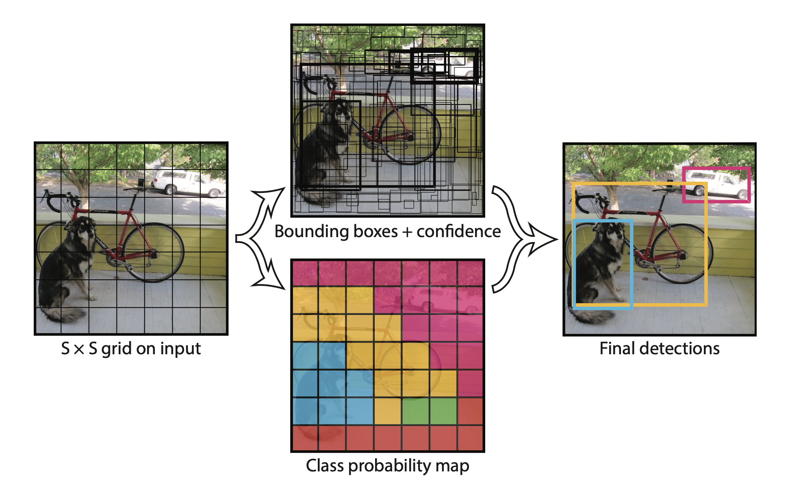

.. Yolo documentation master file, created by
   sphinx-quickstart on Sat Oct 21 23:49:35 2023.
   You can adapt this file completely to your liking, but it should at least
   contain the root `toctree` directive.

Yolo for Culinary : A Deep Learning Approach
============================================

.. toctree::
   :maxdepth: 2
   :caption: Contents:

My implementation of yolo algorithm to be later used for culinary 
computer vision tasks.

YOLO Architecture from `paper <https://arxiv.org/abs/1506.02640>`_
-------------------------------------------------------------------

Folder Structure
----------------

.. code-block:: bash

   yolo
   ├── config
   │   └── defaut.toml
   ├── dataset
   │   └── VOCdevkit
   │       └── VOC2012
   ├── docs
   │   ├── images
   │   │   ├── input_output.png
   │   │   └── test.png
   │   ├── source
   │   │   ├── conf.py
   │   │   └── index.rst
   │   ├── Makefile
   │   ├── make.bat
   │   └── requirements.txt
   ├── examples
   ├── images
   │   └── example.jpg
   ├── tests
   │   ├── test_bbox.py
   │   ├── test_main.py
   │   ├── test_model.py
   │   └── test_utils.py
   ├── yolo
   │   ├── bbox.py
   │   ├── dataset.py
   │   ├── gridcell.py
   │   ├── model.py
   │   ├── trainer.py
   │   ├── utils.py
   │   └── yolo.py
   ├── LICENSE
   ├── README.md
   ├── pytest.ini
   ├── requirements.txt
   └── setup.py

Indices and tables
==================

.. toctree::

   usage
   modules
   api